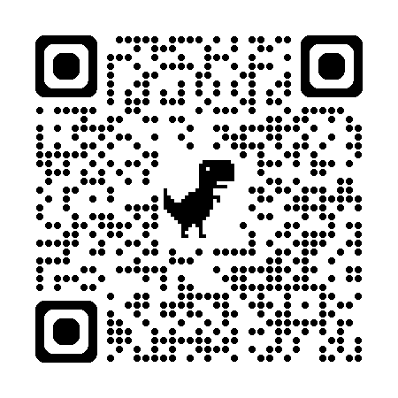

# 骗子博弈 (Liar's Gambit)

单文件 HTML5 P2P 多人卡牌游戏。支持 2–8 人联机，基于 PeerJS WebRTC 点对点连接。游戏风格为“漫画手绘”，提供 1–3 副牌（每副 54 张）并以颜色区分。

## 特性

- **P2P 多人联机**：PeerJS + WebRTC DataChannel（星型拓扑，房主权威状态）
- **1–3 副牌**：每副 54 张，红/蓝/绿配色区分
- **胜利条件**：先打光手牌即胜
- **质疑机制**：顺序/乱序质疑（房主在大厅设置）
- **断线重联与房主迁移**：房主断线后自动迁移，玩家可重连
- **移动端友好**：安全区适配、底部手牌抬高

## 如何运行

本项目为纯前端静态文件，无需构建。推荐使用微信扫码打开避免不同浏览器限制(无法打开可以刷新几次)。

### 方式一：直接打开

双击 `index.html`  打开（部分浏览器可能限制 WebRTC 连接）。

### 方式二：网页链接（推荐）

访问：[`https://lu123bing.github.io/liars-gambit/`](https://lu123bing.github.io/liars-gambit/)

## 目录结构

- `index.html` ：单文件完整版（HTML/CSS/JS）
<!-- - `index2.html`：备份/实验版本（如存在） -->

## 开始游戏

1. 输入昵称，创建房间
2. 让玩家扫码或输入房间号加入
3. 设置牌组数量、质疑模式、出牌记录显示
4. 点击“开始游戏”

## 局域网联机说明

1. 所有玩家连接同一 Wi-Fi 网络。选择一个稳定的设备作为房主，其他玩家加入其房间。
2. 热点连接: 如果没有 Wi-Fi，可以使用手机热点。房主开启热点，其他玩家连接后加入房间。
3. 断联重联: 如果玩家断线，重新连接同一房间号即可恢复游戏状态(功能还在测试)。

## 依赖

- [PeerJS](https://peerjs.com/)（CDN）
- [QRCode.js](https://davidshimjs.github.io/qrcodejs/)（CDN）
- Google Fonts: Patrick Hand

## 📜 游戏规则 (骗子博弈)

### 🎯 游戏目标
率先打光手中所有手牌的玩家获胜。

### 🃏 牌组说明

- 使用 1-3 副标准 **54 张** 扑克牌（含大王 & 小王）。
- **🤡 大王 & 小王** 是万能牌——出牌时可充当任何数字，被质疑时 **始终视为真牌**。

### 👑 庄家起手

- 每轮开始，庄家指定一个 **目标数字**（如 "8"）。
- 庄家必须先出牌，声称它们都是指定数字。
- 声明的 **数量必须真实**（打几张说几张），但 **数字可以造假**！

### 🔄 玩家回合

从庄家下家开始顺时针，每人可选：

1. **🃏 跟牌**：打出任意张数的牌，声称都是目标数字。同样：数量真实，数字可假。
2. **⏭️ 过**：跳过本次，后续轮次仍可出牌。
3. **⚡ 质疑**：对上一位出牌者喊出 "质疑！"。

### ⚡ 质疑机制

质疑将翻开 **上一位出牌者** 最后打出的牌：

- **质疑成功**（牌中有假）：被质疑者 **收走牌池所有牌**，**质疑者** 成为下轮庄家。
- **质疑失败**（全是真牌/万能牌）：质疑者 **收走牌池所有牌**，**被质疑者** 成为下轮庄家。

> 💡 **质疑模式** 由房主在大厅设置：
> - **顺序质疑**：仅出牌者的下家可质疑。
> - **乱序质疑**：任何人都可抢先质疑（手快有，手慢无）。

### 🔚 轮次结束

- 如果出牌后所有人都选择了“过”，该轮结束。
- 牌池中所有牌进入 **弃牌堆**（不再使用）。
- 最后出牌者成为新庄家，开始下一轮。

### 🏆 胜利条件

打出最后一张牌且未被成功质疑 → **获胜！**

### 💡 策略提示

- **🤡 万能牌妙用**：混入真牌中出牌，诱导对手错误质疑！
- **📊 数量陷阱**：大量出牌施压，或少量出牌钓鱼——抉择在你。
- **👀 记牌读心**：注意已出过的牌和各人反应，抓住破绽！

## 音效来源与授权说明

本项目部分音效来源于 **Pixabay**，遵循其 Content License 使用。

- 音效来源页：<https://pixabay.com/>
- 平台许可说明（摘要）：可免费使用、可修改、通常无需署名；但不得将素材原样单独售卖/分发，不得用于误导、违法或商标用途等。
- 完整许可条款：<https://pixabay.com/service/license-summary/>

> 说明：以上为许可摘要，最终以 Pixabay 官方完整条款为准。

## 许可

仅供学习和交流使用。
